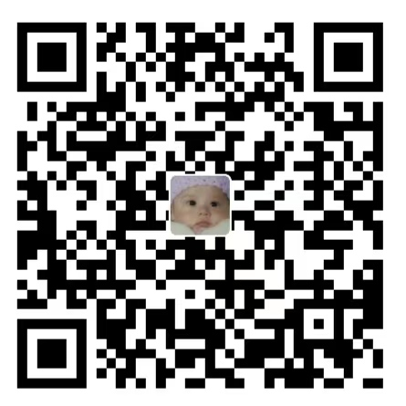

# Support Noria

[中文](#中文) · [Community](COMMUNITY.md)

Noria is an open-source project maintained independently. Voluntary support helps sustain development, testing, documentation, and maintenance.

Sponsorship does not unlock features or purchase priority fixes or dedicated support. Bug reports, workflow examples, and documentation contributions are also welcome.

## Alipay

Scan this QR code with Alipay to support Noria.

## 中文

Noria 是由个人持续维护的开源项目。自愿赞助用于支持开发、测试、文档和日常维护。

赞助不影响功能使用，也不购买优先修复或专属支持。反馈问题、分享真实使用场景和完善文档，同样是在帮助项目。

### 支付宝

使用支付宝扫描二维码，自愿支持 Noria 的开发与维护。

[社区交流](COMMUNITY.md#中文) · [参与贡献](../CONTRIBUTING.md)
