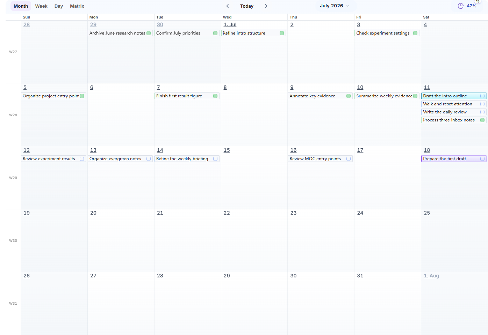
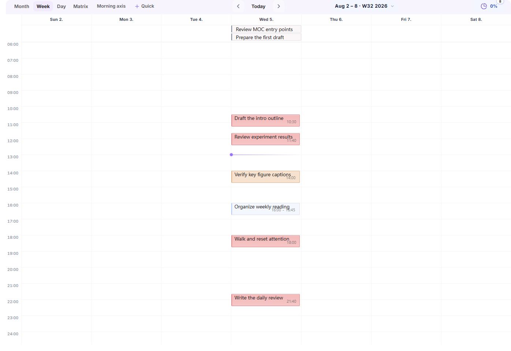
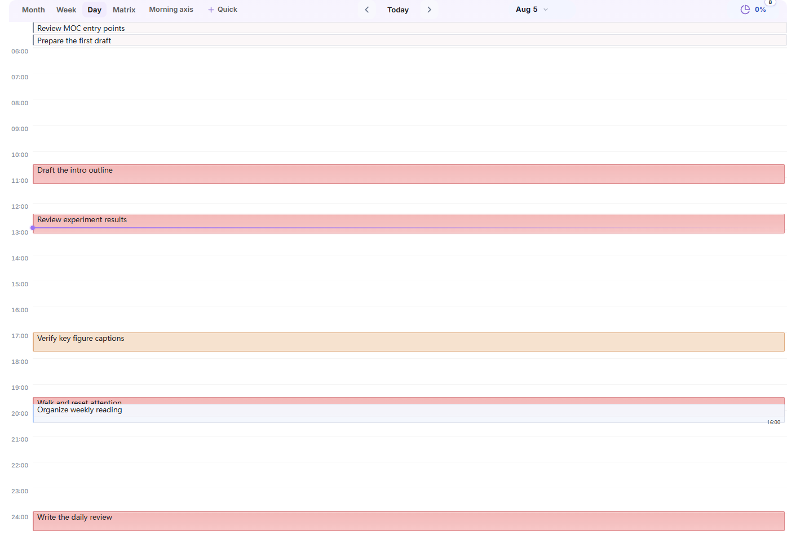
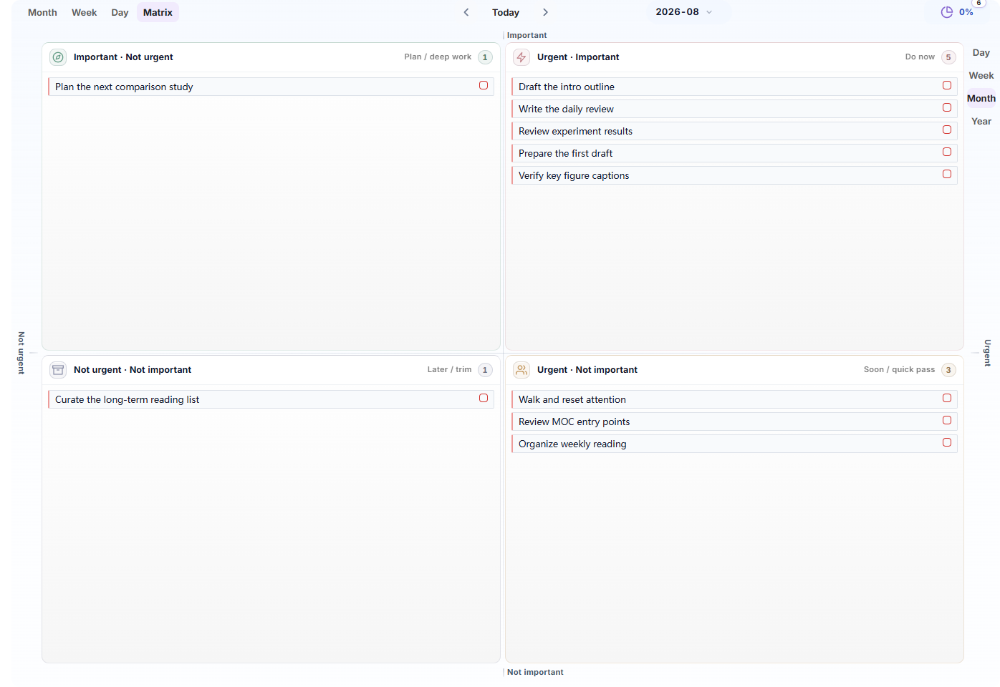

# Noria User Guide

**Language**: English | [简体中文](zh-CN/USER-GUIDE.md)

Noria connects daily records, accumulated knowledge, planning, execution, and review in one Obsidian workbench. It uses ordinary Markdown as its content foundation and provides a configurable Home, Task Board, Task Timeline, Calendar, Habits, Trends and Statistics, and Review Center so you can see the current state, choose the next useful action, and keep long-term knowledge connected to ongoing work.

This guide starts with installation, then covers every module, common workflows, troubleshooting, paths, and advanced extension boundaries. For the product overview and release information, see the [README](../README.md).

## 1. Installation And Initialization

### 1.1 Requirements

Noria is currently a desktop plugin and requires Obsidian `1.5.0` or newer.

When Noria is available through Community plugins, search for **Noria** and enable it. For manual installation, place only the three GitHub Release files in:

```text
.obsidian/plugins/noria/
|-- manifest.json
|-- main.js
`-- styles.css
```

Obsidian creates `data.json` after settings are saved. Do not copy `src/`, `tests/`, `scripts/`, or `node_modules/` from the source repository into a user plugin directory.

The Noria interface follows the Obsidian language. Unsupported languages fall back to English.

### 1.2 Choose A Workspace Mode

The first time you open `Settings -> Noria -> Overview`, choose one mode:

- **Standard workspace**: for a new vault, a test vault, or a vault that keeps Noria-managed content under `Noria/`.
- **Custom paths**: for a vault that already has Inbox, Projects, Diary, MOC, and template structures.

IPARA is not a third profile. For an IPARA vault, choose Custom paths, keep Noria lists and workflow files under `02_Areas/Noria/`, and map content roots to the existing top-level buckets.

### 1.3 Initialization Flow

Noria does not silently create or move files at startup. Use this order:

1. Review the workspace preview and missing items.
2. Check Inbox, Projects, Diary, template, and registry paths.
3. Confirm which files and parent directories will be created.
4. Run initialization or repair.
5. Open Home and inspect the sample project, tasks, habits, and countdowns.
6. Follow one sample task to its Markdown source and verify that Task Board and Task Timeline read the same task.

Initialization creates only missing content and never overwrites an existing file. New users can keep the small example set until the workflow is familiar, then edit or remove it.

### 1.4 First Acceptance Check

- Home opens, and an unspecified avatar uses the Noria mark.
- All four Task Board views can be selected.
- Task Timeline loads without opening Task Board first.
- Calendar creates period notes under the configured path.
- Habit, countdown, project, and MOC entries open their source files.
- Review Center is available on Home and supports Day, Week, Month, and Year.
- Weather is off in a fresh installation. The first explicit workspace initialization enables it; later repairs preserve the user's choice. Configure a location or provider only when weather is needed.

## 2. Home

Home is Noria's central workbench, not a fixed collection of features. It organizes current state, next actions, knowledge entrances, and longer-term observations on one configurable page.


### 2.1 First-Screen Structure

The default first screen is organized as:

1. Identity, quote, weather, and overview metrics.
2. Capture, task input, and current progress.
3. Today Tasks, Inbox, and Countdown cards.
4. Projects and MOC entrances.
5. Trends and Statistics, followed by Review Center.

The default order is only a starting point. Every major card can be managed as a level-one widget.

### 2.2 Capture And Task Input

Home provides two input modes:

- **Capture** writes an idea, clue, or temporary record to today's diary Inbox.
- **Task** writes an actionable item to today's diary task section.

Input, mode selection, submission, and adjacent navigation stay on one line. Captured material does not need to be classified immediately.

### 2.3 Today Tasks

Today Tasks group work by pace and current capability instead of keeping deadline pressure permanently visible.

- Incomplete tasks use clearer weight.
- Completed tasks stay readable without an aggressive strike-through treatment.
- A suggested first task is naturally sorted to the top with a quiet marker instead of a separate recommendation panel.
- Clicking a task opens its source; hovering shows dates, tags, project, and source details.
- Day, Week, Month, and Year ranges remain available.

An unfinished task can continue the next day. Noria does not treat rollover as punishment.

### 2.4 Inbox

The Inbox card shows the current queue, workflow groups, and a small set of actionable items. Its header keeps view switching, queue opening, and add actions. The guide area does not duplicate a second Inbox card.

A compact habit entry may appear below the Inbox list, but it does not repeat full habit history.

### 2.5 Countdowns

Countdowns occupy the third first-screen column. Each item emphasizes remaining days and a progress bar without repeating a date that can be derived from the source. Urgency uses restrained semantic color instead of a side rail or a large warning surface.

### 2.6 Projects And MOCs

- Project cards connect registry entries, project home notes, and current incomplete tasks.
- MOC cards provide stable knowledge entrances. Markdown is the primary entrance; Canvas is an optional visual view.
- Home shows entrances and current actions rather than copying entire project or knowledge documents.

### 2.7 Home Widgets

In Home edit mode or `Settings -> Noria -> Home`, you can:

- enable or hide widgets;
- drag to reorder them;
- change width and grid span;
- choose the default expanded or collapsed state;
- add Markdown, action, stat, Base, list, or trusted custom view widgets;
- restore hidden built-in widgets.

Cards in the same row align to the grid row height. Hover settings controls stay near the card boundary and should not cover the card's own actions.

### 2.8 External Markdown Workbench

Markdown widgets can read daily briefings, current suggestions, weekly reviews, and project-monitor files produced by external agents, RSS workflows, or other scripts. Noria displays the content, source handoff, and freshness state; the external workflow remains responsible for generating it.

## 3. Task Board

Task Board organizes Markdown tasks from diary, project, and regular notes into four complementary views. Tasks remain in their source files.

### 3.1 Month

Use Month to review task distribution, multi-day work, deadlines, and workload over a longer span. Start with the overall shape, then move into Week or Day to arrange time.



### 3.2 Week

Use Week to arrange tasks and time blocks across the current week. Parallel tasks adapt title and time detail to the available width and height while preserving task identity.



### 3.3 Day

Use Day for concrete daily arrangement. Untimed and all-day tasks stay at the top; tasks with a time range enter the hourly grid.



### 3.4 Matrix

Use Matrix to reconsider importance and urgency when the task pool grows. The four areas reorganize one task pool; they do not duplicate tasks.



### 3.5 Edit Tasks

The task editor supports:

- title and tags;
- priority and status;
- `start`, `scheduled`, `due`, `completion`, and related dates;
- start and end time;
- recurrence and before/after dependencies;
- source opening, saving, and deletion.

In any Markdown note, place the cursor on a task or plain text line and run **Noria: Edit or create task at cursor**.

### 3.6 Create Period Notes

When a selected date has no matching note, Noria creates it from the active path and template by default. Enable creation confirmation in Calendar settings when you want an explicit prompt.

## 4. Task Timeline

Task Timeline is Noria's own time view for observing tasks across dates, time blocks, and stages. Tasks still come from source Markdown; the view provides organization, filtering, and interaction.


### 4.1 Main Area And Sidebar

- The main editor area is useful for longer ranges, layer filtering, and broader inspection.
- The sidebar is designed to stay open as a compact view of the current schedule. Titles adapt to available vertical space.

Task Timeline should load after Obsidian restores the workspace and should not require Task Board to be opened first.

### 4.2 Navigation And Scale

- Click **Today** to return to the current date.
- Use the wheel to pan horizontally through time.
- Drag an empty part of the time band to pan.
- Use `Ctrl/Cmd + wheel` to zoom.
- Click or drag the overview band to navigate quickly.

Axis labels change between year, month, day, hour, and minute according to the range instead of repeating the same date.

### 4.3 Task Visuals And Write-Back

A task title, position point, and interval bar form one visual unit:

- a point task keeps one position point aligned with its title;
- interval handles appear only while hovering or editing;
- incomplete tasks use clearer weight, while completed tasks remain normal;
- full titles are shown when space allows and truncated only when necessary;
- clicking a title opens the Markdown source;
- dragging a task or interval boundary writes back to the source task line.

Before writing, Noria checks the source fingerprint and rejects an overwrite when the source has changed.

### 4.4 Layers And Filters

Available layers include tasks, marks, notes, Git, Noria, and Pomodoro. Pomodoro is off by default.

Filters support:

- showing or hiding completed tasks;
- text queries;
- including only specified tags;
- excluding specified tags;
- Mark mode.

Filters change only the view and do not modify tasks.

### 4.5 Named Views

A frequently used timeline state can be saved with a custom name. It includes:

```text
name, time center, scale, layers, completion state, query,
include tags, exclude tags, mark mode
```

When the current state differs from a saved view, Noria marks it as modified. Only an explicit update overwrites the saved view.

## 5. Calendar

Noria Calendar lives in the sidebar and opens or creates daily, weekly, monthly, quarterly, and yearly notes.

### 5.1 Main Actions

- Click a date to open its diary note.
- Switch between Day, Week, Month, Quarter, and Year entrances.
- Return quickly to today.
- Create a period note when the target does not exist.
- Use the configured template for initial content.

### 5.2 Creation Behavior

Clicking a missing date creates its note directly by default. Settings can require confirmation and can control whether a newly created note opens automatically.

### 5.3 Date Sources

Calendar supports three sources:

- **Noria** uses Diary root and templates from `Overview -> Paths`.
- **Daily Notes** reads Obsidian Daily Notes settings.
- **Custom** uses a separately configured folder, naming pattern, and template.

Only fields relevant to the active source are shown, preventing multiple path systems from competing on the same page.

## 6. Habits

Habits separate today's completion from long-term formation.

### 6.1 Today's Habits

The compact habit entry under the Home Inbox card is for quick check-in and does not repeat historical charts.

### 6.2 Habit Cards

The full habit card shows habit names, date columns, and check-in states. Habit names reuse MOC card title size and weight so typography stays consistent across Noria.

Supported behavior includes:

- checkbox habits;
- numeric habits;
- targets and units;
- adding, editing, pausing, and marking a habit as established;
- refreshing sleep habits from `#tl/sleep`.

### 6.3 History And Heatmaps

Full habit history lives in Trends and Statistics. Today's chips are not repeated there. Habit history, an individual habit heatmap, and the aggregate heatmap are independent Home widgets that can be added, hidden, reordered, and resized.

## 7. Trends And Statistics

Trends and Statistics are for observing sustained change, not evaluating yourself every day.

### 7.1 Shared Range

All statistics cards share one range control:

- Recent 30 days;
- Week;
- Month;
- Year;
- Custom range.

### 7.2 Note Trend

Note Trend shows the number of newly created notes and the current word count of diary files. Word count describes current file content and is not the same as words added on that day.

### 7.3 Task Completion Trend

This chart shows total task activity, completed tasks, and completion rate. Completed tasks without a completion date stay in an undated group instead of being forced into a day.

### 7.4 Habit And Workload Heatmaps

- Habit heatmaps can show one selected habit or the aggregate.
- Workload heatmaps normalize note, task, and word-count activity into relative intensity. They are not exact time tracking.

### 7.5 Note Distribution

Note Distribution groups notes by top-level vault directory, not by tags. It helps reveal long-term content distribution and is not a score for how many folders you have.

### 7.6 Daily State

Daily State shows continuous signals such as mood, weather, energy, and focus. Mood, energy, and focus are editable; weather is a read-only service result. The card aligns with adjacent statistics cards and stays visually quiet when data is sparse.

## 8. Review Center

Review Center lives on Home and supports Day, Week, Month, and Year. The final editor is primary; evidence and external analysis expand only when needed.


### 8.1 Core Flow

1. Select a period and target date.
2. Start writing directly in the final editor.
3. Expand evidence and analysis only when useful.
4. Prepare local evidence and save the external-agent prompt to Noria's local cache.
5. Refresh and inspect the external review note.
6. Adopt only grounded content with action value.
7. Save explicitly to the diary or period note.

### 8.2 Daily Review

The daily final review contains:

- Summary;
- GDD Highlight, Deviation, and Blocker;
- Gratitude;
- Personal reflection.

Gratitude and Personal reflection use equal editor heights. External analysis does not infer or overwrite personal records. Mood, weather, energy, and focus belong to separate Daily State data.

### 8.3 Weekly, Monthly, And Yearly Review

Period reviews use one complete Markdown final editor. Saving writes to the review section of the target period note instead of splitting the result across repeated forms.

### 8.4 Evidence And External Agents

Noria prepares local evidence JSON and prompts for an external agent but does not call a model inside the plugin. The `noria-review` workflow can combine:

- Noria evidence for the target period;
- Codex task conversations for the target date;
- planning triplets for candidate projects;
- verifiable files, tests, and Git artifacts.

The review groups work by project owner and keeps one global through-line. It does not mechanically create a next action for every project.

### 8.5 Save Protection

- Unsaved content enters a recovery draft.
- Noria blocks an overwrite when the target note changed externally.
- External analysis remains an editable draft.
- Only explicit saving writes to Markdown.

## 9. Settings

Noria settings have seven top-level pages.

### 9.1 Overview

Overview initializes and checks the workspace:

- Standard workspace and Custom paths;
- missing files and directories;
- folded path groups;
- module switches;
- query range and performance;
- initialize, repair, and open actions.

### 9.2 Home

Home settings cover:

- display name, salutation, avatar, and quotes;
- level-one Home widgets;
- MOC entrances;
- Inbox workflow;
- review prompts;
- weather.

Home uses one widget manager instead of separate legacy managers for the first screen, workbench, and trends.

### 9.3 Tasks

Tasks settings control Task Board opening behavior, scan range, include and exclude tags, status policy, and advanced queries.

### 9.4 Timeline

Timeline settings control opening position, drag step, default layers, completion state, scale, named views, and context axis.

### 9.5 Calendar

Calendar settings select Noria, Daily Notes, or Custom as the date source and control confirmation, open-after-create, today highlight, and period templates.

### 9.6 Appearance

Appearance controls density, theme following, status colors, tag colors, and planner details. It presents visible semantic choices instead of requiring ordinary users to edit raw tokens.

### 9.7 Maintenance

Maintenance provides:

- Noria installation checks;
- a locally saved troubleshooting report;
- settings backup export and import;
- SecretStorage status;
- trusted custom JavaScript view management;
- developer diagnostics when expanded.

## 10. Markdown, Data, And External Workflows

### 10.1 Data Boundaries

| Layer | Content | Source of truth |
| --- | --- | --- |
| Content | Notes, tasks, projects, diary, habits, countdowns | Markdown or Base |
| Configuration | Paths, modules, Home layout, view preferences | Plugin `data.json` |
| Derived | Statistics snapshots, review evidence, recovery drafts | Regenerable support data |
| Credentials | Weather service keys | Obsidian SecretStorage |

Noria does not convert the vault into a private database. Ordinary Markdown remains readable and editable when the plugin is disabled.

### 10.2 Tasks

Noria reads standard Markdown tasks:

```markdown
- [ ] Organize experiment results [start:: 2026-08-04] [due:: 2026-08-07]
- [x] Complete the first draft [completion:: 2026-08-03]
```

Tasks can include `start`, `scheduled`, `due`, `completion`, `created`, `cancelled`, priority, and related fields. Task Board, Task Timeline, and Calendar edit the same source line.

### 10.3 Timeline Events

Tasks with `#tl/` tags and time fields can enter Task Timeline. Event templates live in `Event library.md`:

```markdown
- [x] Deep work [default_tag:: #tl/focus] [default_start:: 09:00] [default_duration_min:: 90] #tl/template
```

### 10.4 Habits, Projects, And Countdowns

- `Habits.md` stores active, paused, and established habits.
- `#habit` tasks are excluded from ordinary task lists by default.
- `Projects.md` uses groups and wikilinks for project entrances.
- `Countdowns.md` stores important dates in a Markdown table.
- `Inbox workflow.md` defines handling rules; `Inbox queue.base` provides the queue view.

### 10.5 Diary And Review

Daily, weekly, monthly, and yearly notes remain ordinary Markdown. Noria view blocks provide dynamic views, while prose and personal records remain under user control.

### 10.6 External Content On Home

Markdown briefing sources use:

```text
name | path | role | freshness hours
```

For example:

```text
Daily briefing | Noria/Inbox/daily-brief.md | daily | 36
Current suggestions | Noria/Inbox/current-suggestions.md | current | 72
```

Available roles include `daily`, `current`, `weekly`, `project`, and ordinary note.

### 10.7 External Agent Collaboration

1. An external agent reads selected Markdown, review evidence, or a Noria JSON export.
2. The agent writes a briefing, suggestion, project monitor, or review result to an agreed file.
3. Noria displays the content and preserves source navigation.
4. Diary and final review content is written back only after user confirmation.

### 10.8 Security Boundary

- Custom JavaScript views are disabled by default.
- Only explicitly trusted vault-relative paths run.
- Protocol URLs, absolute paths, and path traversal are blocked.
- Noria does not silently move notes, reorganize folders, or rewrite unrelated prose.

## 11. Common Workflows

Noria does not require every module to be used every day.

### 11.1 Start The Day

1. Open Home and check current progress and active projects.
2. Choose a task that fits the current pace.
3. Check today's habits and nearby countdowns.
4. Open Task Timeline or Calendar only when a concrete time arrangement is useful.

### 11.2 Capture Quickly

- Use Capture for ideas and clues that belong in today's diary Inbox.
- Use Task when the item is already actionable.

### 11.3 Process Inbox

Use this order:

```text
delete -> merge -> split/refine -> file/archive -> defer
```

Remove temporary `inbox-*` fields when content leaves Inbox.

### 11.4 Use Task Board

- Month shows longer-term distribution.
- Week arranges the near-term schedule.
- Day handles today's time blocks.
- Matrix reconsiders priority.

### 11.5 Use Task Timeline

1. Use Today, wheel pan, background drag, or the overview band to locate the range.
2. Choose layers, completion state, and tag filters.
3. Click a title to open its source; hover for details.
4. Drag a task or interval boundary when time needs adjustment.
5. Save a useful center, scale, layer set, and filters as a named view.

### 11.6 Advance Projects And Knowledge

Open a project home note from the Home project card, maintain tasks and stage outputs inside the project, and connect reusable conclusions to the appropriate MOC.

### 11.7 Use Habits And Trends

Use Home for today's check-in. Keep full habit history and heatmaps in Trends and Statistics. Trends are more useful during weekly and monthly review than as a daily score.

### 11.8 Receive External Briefings

An external workflow generates Markdown and Home displays its summary and source. After reading, decide whether the content should become a task, project material, or long-term note.

### 11.9 Complete A Daily Review

Write directly in the final editor. Prepare evidence and use an external agent only when useful. Adopt grounded content, then save explicitly to the diary.

### 11.10 Review A Period

Inspect task, project, habit, Daily State, and trend evidence. Separate completed work, still-useful work, items to adjust, and items to stop, then keep only a small number of priorities for the next period.

### 11.11 Minimal Use

```text
capture on Home -> choose the next task -> update Markdown -> review when useful
```

## 12. FAQ And Troubleshooting

### 12.1 Standard Diagnostic Order

1. **Entrance**: confirm the module is enabled and the intended view is open.
2. **Source**: confirm the Markdown exists, is saved, and uses the expected format.
3. **Scope**: confirm paths, scan roots, dates, and tag filters include the target.
4. **Refresh**: use the view refresh or retry action, then reopen the view.
5. **Diagnostics**: run the installation check under Maintenance and save the report.

Do not begin by deleting `data.json`, rebuilding every file, or reinstalling the plugin.

### 12.2 A View Opens Blank

Check that the plugin and module are enabled, required paths exist, and the view is not still loading. Use Retry or reopen the view. If Task Timeline must be restored by opening Task Board after every restart, treat that as a startup recovery bug.

### 12.3 Tasks Do Not Appear

Check Markdown task syntax, whether the source is saved, scan scope, include and exclude tags, date range, and whether the current view hides completed, cancelled, undated, or habit tasks.

### 12.4 Board, Timeline, And Calendar Disagree

Compare date range, completion state, tag filters, and undated-task policy. The three views share task facts but serve different display goals, so item counts alone are not sufficient.

### 12.5 Timeline Is Slow Or Cannot Be Operated

Confirm that the pane is not a diagnostic shell, narrow the task scan scope, reduce unrelated layers, and check for source conflicts. Persistent blank state, unresponsive wheel panning, or recovery only after rerunning a command should be reported as a bug.

### 12.6 A File Was Created In The Wrong Folder

Check Diary, Inbox, Projects, template, and registry paths under `Overview -> Paths`. **Replace all paths** switches the entire mapping, so inspect the preview before applying it.

### 12.7 A Home Widget Has No Content

Check whether the widget is enabled, its source path exists, the file is non-empty, the briefing is still fresh, and the widget is not hidden. Stale Markdown should not present itself as current information.

### 12.8 Statistics Differ From Expectations

Check the shared time range, task completion dates, note scan scope, diary naming, habit source, and saved file state. Incomplete data is not the same as zero.

### 12.9 Review Cannot Save Or Refresh

Check the target period note and path. After an external agent updates its note, use Refresh. When a source conflict appears, compare the target note instead of forcing an overwrite.

### 12.10 Weather Does Not Appear

Weather is off before first initialization. After enabling it, choose a location or city, configure SecretStorage credentials when the provider requires them, and use manual refresh to verify the result.

### 12.11 An External Briefing Does Not Appear

Check that the target `.md` file was generated, source path and role are correct, modification time is within the freshness window, and the body is not empty.

### 12.12 Restore Settings

Prefer importing a settings backup, filling missing paths, restoring one module's defaults, or recreating missing files. Delete `data.json` only when you intentionally want to clear all settings.

### 12.13 Report A Problem

Include Noria, Obsidian, and operating-system versions, the affected module, minimal reproduction steps, a screenshot, the Maintenance report, and relevant console errors. Do not include API keys, complete private diaries, or unrelated vault content.

## Appendix A: Paths And Data Storage

### A.1 Standard Workspace

| Purpose | Default path |
| --- | --- |
| Timeline settings | `Noria/Timeline settings.md` |
| Event templates | `Noria/Event library.md` |
| Countdowns | `Noria/Countdowns.md` |
| Habit registry | `Noria/Habits.md` |
| Project registry | `Noria/Projects.md` |
| Inbox workflow | `Noria/Inbox workflow.md` |
| Inbox queue | `Noria/Inbox queue.base` |
| Inbox content | `Noria/Inbox/` |
| Projects root | `Noria/Projects/` |
| Diary root | `Noria/Diary/` |
| Daily, weekly, monthly, and yearly templates | `Noria/Templates/` |
| Avatar and quotes | `Noria/avatar.svg`, `Noria/Quotes.md` |

Standard initialization can also create `Noria/Workflow·MOC.md` and `Noria/Knowledge Base·MOC.md`. The current version does not require `Noria/Home.md`; Home is a plugin view.

### A.2 Recommended IPARA Mapping

| Purpose | Recommended path |
| --- | --- |
| Noria lists and workflow files | `02_Areas/Noria/` |
| Noria templates | `02_Areas/Noria/Templates/` |
| Inbox content | `00_Inbox/` |
| Project content | `01_Projects/` |
| Diary and period notes | `06_Diary/` |
| MOC entrances | `05_MOC/` |
| Avatar and quotes | `02_Areas/Noria/` |

Changing configuration does not move existing files. Initialization creates only missing content.

### A.3 Plugin Configuration And Cache

```text
.obsidian/plugins/noria/data.json
.obsidian/plugins/noria/cache/stats/snapshots/
.obsidian/plugins/noria/cache/stats/tasks/
.obsidian/plugins/noria/cache/stats/review/
.obsidian/plugins/noria/cache/review/recovery-drafts.json
```

Markdown, Base, Canvas, templates, and final review notes should be preserved. Statistics caches and evidence can be regenerated. Before clearing cache, confirm that there is no unsaved recovery draft.

### A.4 Review Paths

Final review notes follow Diary root:

```text
06_Diary/2026/2026-08-04-review.md
06_Diary/2026/2026-W32-review.md
06_Diary/2026/2026-08-review.md
06_Diary/2026/2026-review-month.md
06_Diary/2026/2026-review-week.md
```

The Standard workspace uses the same names under `Noria/Diary/`.

### A.5 Migration And Backup

Preserve user content, Noria registries and templates, final review notes, and a settings export. Statistics caches usually do not need to move. SecretStorage credentials such as weather keys must be configured again on a new device.

## Appendix B: Advanced And Developer Reference

### B.1 Extension Boundaries

Noria provides three extension surfaces:

1. Markdown file contracts;
2. versioned JSON exports;
3. trusted custom JavaScript views.

Internal DOM, CSS class names, cache implementation, refresh hooks, and source-module paths are not stable public interfaces.

### B.2 Custom JavaScript Views

Custom views are disabled by default. When enabled, vault JavaScript receives access to Obsidian, Noria, `window`, and `document`; it is not a security sandbox.

```js
const bridge = input.noriaBridge;
const result = await bridge.data.getSnapshot({
  preset: "home",
  range: { mode: "last30" }
});

const el = document.createElement("pre");
el.textContent = JSON.stringify(result.range, null, 2);
input.mount.appendChild(el);
```

Run only code that you wrote or reviewed, and prefer the injected `input.noriaBridge`.

### B.3 Public Data API

```js
bridge.data.resolveRange(request)
bridge.data.getSnapshot(request)
bridge.data.getTasks(request)
bridge.data.getTimelineAnnotations(request)
bridge.data.getTimelineTraces(request)
bridge.data.getPeriods(request)
bridge.data.getReviewEvidence(request)
bridge.data.export(request)
```

`data.invalidate()` is an internal refresh hook and is not part of the public contract.

### B.4 Ranges And Presets

Ranges include `last30`, `week`, `month`, `year`, `custom`, and `homeCurrent`. Built-in presets include `home`, `board`, `timeline`, `periodic`, `review`, and `exportAll`.

### B.5 Snapshot

```json
{
  "meta": { "schemaVersion": 1, "request": {}, "resolvedRequest": {}, "policy": {} },
  "range": {},
  "granularity": "day",
  "domains": {},
  "views": {},
  "warnings": [],
  "sourceCompleteness": {}
}
```

Callers must inspect `schemaVersion`, `warnings`, and `sourceCompleteness`.

### B.6 Task Facts And Write-Back

Task identity is determined by:

```text
sourcePath + line/blockId + fingerprint
```

Write-back must locate the source Markdown, verify the fingerprint, modify only the target task line, and reject an overwrite when the source changed. A renderer does not modify the vault directly.

### B.7 JSON Export

```json
{
  "exportKind": "noria.snapshot",
  "exportVersion": 1,
  "exportedAt": "",
  "noriaVersion": "0.4.2",
  "payload": {}
}
```

Supported kinds include `noria.snapshot`, `noria.tasks`, and `noria.reviewEvidence`. External tools should parse by `exportKind` and `exportVersion`.

### B.8 Compatibility

Extensions should check `bridgeVersion` and data `schemaVersion`, feature-detect optional fields, avoid depending on internal property order, never edit `data.json` directly, and never read or print SecretStorage credentials.

### B.9 Source Validation

```bash
npm ci
npm run build
npm test
npm run release:check
```

The public installation package contains only `manifest.json`, `main.js`, and `styles.css`.
