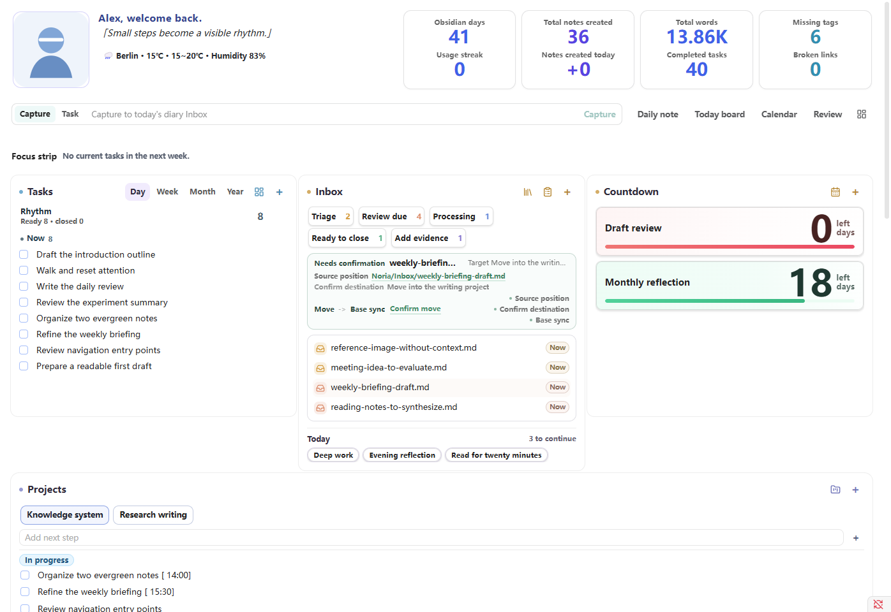
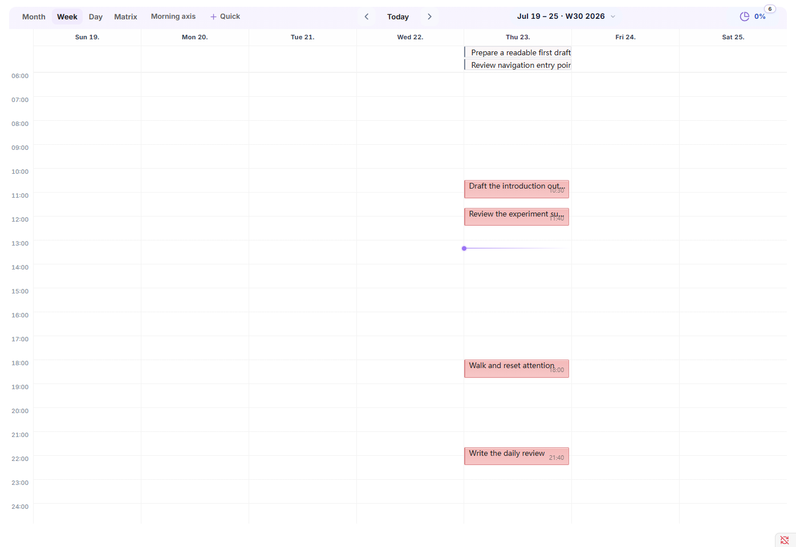
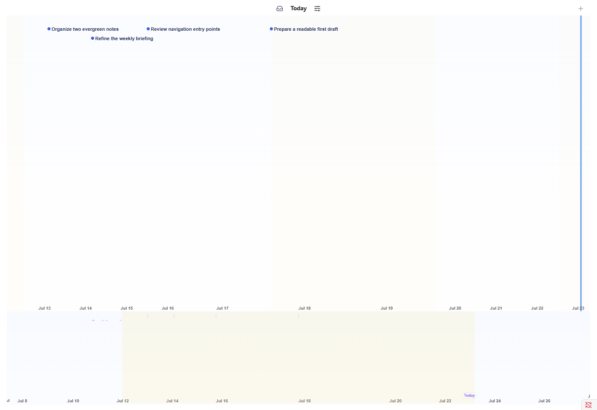
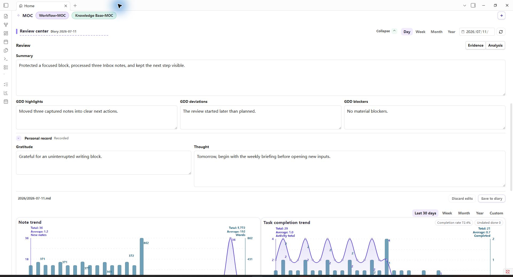

# Noria User Guide

**Language**: English | [简体中文](zh-CN/USER-GUIDE.md)

This guide is for people using Noria inside Obsidian. For installation, see the [README](../README.md). For troubleshooting, see the [FAQ](FAQ.md). For field-level settings details, see [Settings Mapping](SETTINGS-MAPPING.md).

## 1. Core Model

Noria is a workspace layer on top of your vault, not a separate database.

- Notes, tasks, projects, Inbox records, diary entries, habits, and countdowns remain ordinary Markdown or configured vault files.
- Home, Task Board, Task Timeline, Diary Stats, and Review Center read from the same configured paths and scan scopes.
- Task state is read from Markdown source text, so recently edited or completed tasks do not have to wait for a separate external index.
- Review and export workflows reuse the same data layer used by Home statistics and task views.
- Initialization creates missing starter content only when you click the setup action. Startup does not create or move notes in bulk.

The Standard workspace can live under `Noria/`, or you can connect Noria to an existing vault by setting paths manually.

## 2. First-Run Checklist

1. Enable Noria.
2. Open `Settings -> Noria -> Overview`.
3. Choose a workspace profile:
   - **Standard workspace**: best for a new or test vault.
   - **Custom paths**: best when you want to connect an existing vault.
4. Review the missing seed and missing directory summary.
5. Create the missing starter content you want, then open Home and follow one sample task to its source note and Task Board or Task Timeline.
6. Adjust paths and templates only when the standard workspace does not match your vault. Use **Apply missing/default paths** to fill blanks; use **Replace all paths** only when intentionally switching the whole profile.

The Standard workspace uses:

```text
Noria/Home.md
Noria/Habits.md
Noria/Countdowns.md
Noria/Projects.md
Noria/Workflow·MOC.md
Noria/Knowledge Base·MOC.md
Noria/Timeline settings.md
Noria/Event library.md
Noria/Inbox queue.md
Noria/Quotes.md
Noria/avatar.svg
Noria/Templates/*.md
Noria/Diary/
Noria/Inbox/
Noria/Projects/
```

You can edit every path in `Settings -> Noria -> Overview -> Paths`.

## 3. Main Entrances

Noria provides ribbon icons and command palette entries for:

- Home
- Task Board
- Task Timeline
- Task Board day view
- Today focus
- Diary Stats
- Review Center

Any entrance that opens a file or creates a note should follow `Overview -> Paths`. If a path is wrong, fix `Overview -> Paths` first, then reopen the view.

## 4. Home Dashboard

Home is the daily operating surface. It combines planning, capture, navigation, and statistics into one configurable dashboard.

It can show:

- MOC chips for jumping into important knowledge areas.
- Inbox items for managing temporary capture and deciding what needs action, evidence, or destination.
- Project chips and project task lists for active work.
- Today's tasks and period tasks across day, week, month, and year.
- Habits, including quick habit creation and 21-day habit tracking.
- Countdowns and important dates.
- Weather and daily-state records.
- Note trend, task completion trend, habit and workload heatmaps, note distribution, and daily-state distribution.

The trend and statistics area uses one shared range control. The default is recent 30 days; week, month, year, and custom ranges use the same data snapshot across the statistics blocks.



### Home Widgets

Home is also a widget dashboard. The built-in widgets are the default layout, not a fixed page.

In `Settings -> Noria -> Home`, you can manage Home widgets:

- Enable or disable built-in widgets.
- Reorder widgets.
- Change widget size.
- Collapse widgets by default or restore hidden widgets.
- Add Markdown widgets for static or lightweight content.
- Add trusted custom view widgets from vault-relative JavaScript files after enabling the Advanced permission.

Every level-one functional surface is a Home widget: Today Tasks, Inbox, Countdown, Projects, MOC, Review Center, the shared trends range, and the dedicated trend, habit-history, heatmap, distribution, and daily-state cards can be positioned and sized independently. Compact habit context shown inside another workbench card follows that parent instead of becoming a duplicate widget. Identity and metrics still combine into the accepted Hero when they remain adjacent in normal mode, while staying independently configurable.

Markdown widgets are for content and links. They can point to daily briefings, current suggestions, weekly reviews, or project-monitor `.md` files generated by another workflow. Noria reads those files and keeps their source handoff; it does not call a model to create them. Custom JavaScript views are disabled by default; after explicitly enabling **Advanced -> Custom JavaScript views**, trusted view widgets can read Noria data through the runtime bridge, including `noriaBridge.data.*`.

## 5. Inbox, MOC, Projects, Habits, And Countdowns

These Home sections are small operating surfaces rather than separate dashboards.

- **Inbox** is for temporary capture. Use it to collect items before deciding whether they become tasks, project material, notes, or archived references.
- **MOC chips** open the configured Markdown MOC as the primary knowledge entrance. If a same-name Canvas exists, Noria exposes it as a separate optional visual action; an explicitly configured Canvas path still opens directly.
- **Projects** connect project registry entries with tasks under project roots. Project tasks use the same fresh task facts as Task Board and Timeline.
- **Habits** follow a lightweight 21-day tracking model. Add different habits, check them in, and use the heatmap to see continuity.
- **Countdowns** keep important dates visible without turning them into tasks.

## 6. Task Board

Task Board turns tasks from diary, project, and regular notes into planning views.

Use the views by intent:

- **Month**: cycles, deadlines, cross-day work, and high-level distribution.
- **Week**: near-term planning and current work rhythm.
- **Day**: focused daily arrangement.
- **Matrix**: priority and effort decisions.

Tasks remain in their original files. Noria updates the source note when you complete, edit, drag, or reschedule tasks. New tasks can be written to the matching daily, weekly, or monthly note based on the selected period and date span.

Task editing:

- Use the task row edit action in Task Board or Task Timeline to open the task editor.
- In any note, place the cursor on a task line or a plain line and run **Noria: Edit or create task at cursor**. Assign your own shortcut in Obsidian's Hotkeys settings if desired.
- On an existing task, the editor updates the same source line. On a plain line, it can create a task from the current text.
- The editor covers task title, tags, priority, status, dates, and time ranges.

Important settings:

- `Overview -> Paths -> Diary root`: where daily notes are created.
- `Overview -> Paths -> Projects root`: project task source.
- `Tasks -> Include / exclude tags`: task filtering.
- `Tasks -> Query range`: managed roots, whole vault, or custom roots.
- Daily, weekly, monthly, and yearly template paths in `Overview -> Paths`.



## 7. Task Timeline

Task Timeline arranges tasks by date and time block. It uses the same task facts as Task Board, but the display is time-oriented.

Use it to:

- Review today's time blocks.
- Place a task into a specific time range.
- See which tasks are scheduled, waiting, done, or still unplaced.
- Keep the side timeline open as a low-switching-cost rhythm view.
- Compare actual arrangement with the board.

Core interactions:

- Click a task title to open its original Markdown source.
- Drag the timeline background to pan; use `Ctrl/Cmd + wheel` or `+` / `-` to zoom.
- Use **Today** or click the overview band to navigate without losing the side-panel context.
- Drag a point task or the local duration handles to reschedule it. Noria writes back to the original task line and rejects stale-source conflicts instead of overwriting newer Markdown.
- Use Mark mode and `Shift + drag` on the main band to create a range annotation.
- Switch among Tasks, Records, Projects, and All presets, or select task, mark, Pomodoro, note, Git, and Noria layers individually. Pomodoro is off by default.

Auto scale fits the current event context, Today scale centers current work, and Manual scale preserves a user-adjusted center and zoom. The renderer is owned by Noria and does not require a separate timeline runtime.

If Task Board and Task Timeline disagree, check paths first, then task filters, then the current view range.



## 8. Trends And Diary Stats

Home statistics and Diary Stats are built from the shared Noria data layer.

Home focuses on a dashboard range:

- Recent 30 days by default.
- Week, month, year, and custom range controls.
- Year views can aggregate by week or month where the chart supports it.
- Note trend and task completion trend use matched chart language.
- Daily-state distribution follows the same selected range.

Diary Stats focuses on opening an explicit day, week, month, or year statistics view from commands. Weekly, monthly, and yearly notes no longer need embedded statistics blocks; the statistics can be opened independently.

Recommended conventions:

- Keep daily notes under the configured Diary root.
- Use consistent daily filenames.
- Use the configured habit convention for habit check-ins.
- Avoid Markdown task syntax in prose lists unless you want the item to become a task fact.

## 9. Review Center

Review Center helps you review from actual records. It supports daily, weekly, monthly, and yearly modes from the same UI.

Workflow:

1. Open Review Center, then choose `Day`, `Week`, `Month`, or `Year` and its date or period anchor.
2. Start in the final editor: daily review uses compact structured fields; week, month, and year use one editable Markdown draft.
3. Keep writing directly. Noria preserves one minimal recovery draft for the current target until you save or discard it.
4. Open the support area only when needed. The lightweight summary appears first; full task, file, diary, daily-state, and analysis material loads on demand.
5. Prepare or copy an external-AI prompt when useful. Noria writes an evidence file and points the prompt to it; Noria itself does not call a model.
6. Treat any imported or adopted analysis as an editable starting point. It is never saved automatically.
7. Save explicitly. Noria checks for source conflicts before writing the final review back to Markdown.



The review skill may surface one Markdown MOC improvement only when the evidence shows a stable topic or owner entrance is repeatedly hard to find, stale, or materially changed. It does not create MOC coverage metrics, governance tasks, or a maintenance queue.

Review artifacts are ordinary Markdown notes derived from diary or period paths. Examples:

```text
Noria/Diary/2026/2026-05-08-review.md
Noria/Diary/2026/2026-W19-review.md
Noria/Diary/2026/2026-05-review.md
Noria/Diary/2026/2026-review-month.md
Noria/Diary/2026/2026-review-week.md
```

Review evidence is stored under the plugin cache, for example:

```text
.obsidian/plugins/noria/cache/stats/review/2026/2026-05-08.json
.obsidian/plugins/noria/cache/stats/review/2026/2026-W19.json
.obsidian/plugins/noria/cache/stats/review/2026/2026-05.json
```

The prompt uses the `noria-review` skill contract and references `review_note` plus `evidence_file`. An external AI tool should read the evidence file first and then inspect only the few related notes that matter for the review question.

## 10. Data API And Export

Noria exposes a runtime data API for Noria views and advanced custom widgets:

```js
noriaBridge.data.resolveRange(request)
noriaBridge.data.getSnapshot(request)
noriaBridge.data.getTasks(request)
noriaBridge.data.getPeriods(request)
noriaBridge.data.getReviewEvidence(request)
noriaBridge.data.export(request)
```

Common requests:

```js
const snapshot = await noriaBridge.data.getSnapshot({
  preset: "home",
  range: { mode: "last30" }
});

const tasks = await noriaBridge.data.getTasks({
  rangePolicy: "allFacts",
  bucketBy: "active",
  status: "all"
});

const evidence = await noriaBridge.data.getReviewEvidence({
  mode: "weekly",
  date: "2026-05-08"
});
```

Use this API when a custom view should reuse Noria facts instead of scanning the vault again. For external scripts or AI workflows, prefer `data.export()` or Review Center's evidence files, which produce JSON envelopes such as `noria.snapshot`, `noria.tasks`, or `noria.reviewEvidence`.

The API is currently an internal Noria runtime interface. Treat it as stable enough for your own Noria views and scripts, but check the changelog when upgrading.

## 11. Settings

Settings are organized by use:

- **Overview**: setup wizard, missing files, missing directories, module toggles, quick actions, and folded path groups.
- **Home**: profile, MOC, weather, Review Center prompts, Home widgets, and Home display options.
- **Tasks**: Task Board behavior, filters, scan range, and task status behavior.
- **Timeline**: Timeline behavior and timeline-related status.
- **Calendar**: diary roots, date-note creation, templates, quick add, and click behavior.
- **Appearance**: density, color, status colors, and visual tuning.
- **Advanced**: diagnostics, SecretStorage, release/package checks, and low-level JSON settings.

For normal use, start with `Overview`; expand `Paths` only when a path needs attention. `Advanced` is mainly for troubleshooting.

## 12. Path Rules

Noria treats `Overview -> Paths` as the source of truth for normal user paths:

| Purpose | Setting field |
| --- | --- |
| Home guide note | `managedPaths.entryNote` |
| Timeline settings | `managedPaths.timelineSettings` |
| Event library | `managedPaths.templateLibrary` |
| Countdowns / important dates | `managedPaths.importantDates` |
| Habits | `managedPaths.habitRegistry` |
| Projects list | `managedPaths.projectRegistry` |
| Inbox root | `managedPaths.inboxRoot` |
| Projects root | `managedPaths.projectsRoot` |
| Diary root | `managedPaths.diaryRoot` |
| Daily template | `managedPaths.dailyTemplate` |
| Weekly template | `managedPaths.weeklyTemplate` |
| Monthly template | `managedPaths.monthlyTemplate` |
| Yearly template | `managedPaths.yearlyTemplate` |

Default generation rules:

- Startup does not create files in bulk.
- Settings initialization creates only missing seed files and parent directories.
- Feature writes may create a minimal file at the configured target path if the target file does not exist.
- Initialization does not overwrite existing files.

## 13. Common Workflows

### New test vault

1. Install the release assets.
2. Choose the Standard workspace profile.
3. Apply default paths.
4. Initialize missing files.
5. Test Home, Task Board, Timeline, and Review Center.

### Existing vault

1. Choose Custom paths.
2. Set Diary, Projects, Inbox, templates, and list files in `Overview -> Paths`.
3. Use Overview to check missing paths.
4. Initialize only the files you want Noria to create.
5. Add Home widgets gradually after the core paths work.

### External AI-assisted review

1. Open Review Center and write in the final editor first.
2. Open the support area only when evidence or analysis is useful.
3. Prepare or copy the review prompt. Noria writes the local evidence file referenced by that prompt.
4. Run the prompt in an external tool of your choice.
5. Load or paste the result as an editable draft, then save the final review explicitly when it is ready.

## 15. Quick Acceptance Check

After changing settings or updating the plugin, check:

- Home opens and shows the expected MOC chips, Inbox, projects, tasks, habits, countdowns, and statistics.
- Home widget settings can enable, disable, reorder, and resize widgets.
- Task Board creates diary notes under the configured Diary root.
- Task Board and Task Timeline show the expected task pool and update completion state promptly.
- Review Center opens in Day, Week, Month, and Year modes.
- Review Center shows the final editor before support material, can write an evidence file, and can copy the external review prompt.
- Settings Overview does not show unexpected missing seed files or directories.
- The installed plugin directory contains only release assets and `data.json`.
