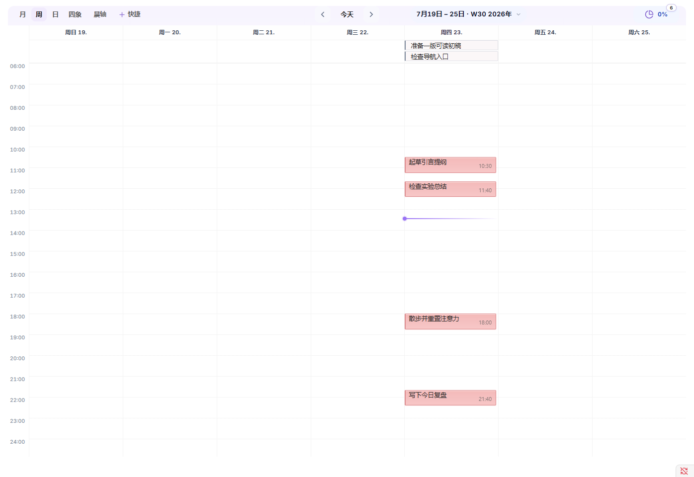

# Noria 用户指南

**语言**： [English](../USER-GUIDE.md) | 简体中文

本指南面向 Noria 使用者。安装方式见 [README](../../README.zh-CN.md)，排查见 [FAQ](FAQ.md)，字段级设置说明见 [Settings Mapping](SETTINGS-MAPPING.md)。

## 1. 核心模型

Noria 是叠加在 Obsidian 库上的工作台层，不是一个独立数据库。

- 笔记、任务、项目、Inbox、日记、习惯和倒计时仍然是普通 Markdown 或设置中配置的库内文件。
- 主页、任务看板、任务时间轴、日记统计和复盘中心读取同一套路径和扫描范围。
- 任务状态直接从 Markdown 原文读取，所以最近编辑或完成的任务不需要等待外部索引追上。
- 复盘和导出复用主页统计与任务视图同一套数据层。
- 初始化只在你点击设置页操作时创建缺失入门内容；启动时不会批量创建或移动笔记。

标准工作区可以放在 `Noria/` 下，也可以通过自定义路径接入已有知识库。

## 2. 首次使用清单

1. 启用 Noria。
2. 打开 `设置 -> Noria -> 总览`。
3. 选择工作区 profile：
   - **Standard workspace**：适合新库、测试库，或希望 Noria 使用独立 `Noria/` 工作区的用户。
   - **Custom paths**：适合已有知识库或需要完全手动维护路径的用户。
4. 检查缺失 seed 和缺失目录摘要。
5. 创建需要的缺失入门内容，打开主页，从一条示例任务进入来源笔记，再到任务看板或任务时间轴查看同一任务。
6. 只有标准工作区不符合现有知识库时再调整路径和模板。**补齐缺失路径**只填空项；只有明确要整体切换 profile 时才使用**替换全部路径**。

Standard workspace 默认使用：

```text
Noria/Home.md
Noria/Habits.md
Noria/Countdowns.md
Noria/Projects.md
Noria/Workflow·MOC.md
Noria/Knowledge Base·MOC.md
Noria/Timeline settings.md
Noria/Event library.md
Noria/Inbox queue.md
Noria/Quotes.md
Noria/avatar.svg
Noria/Templates/*.md
Noria/Diary/
Noria/Inbox/
Noria/Projects/
```

所有路径都可以在 `Settings -> Noria -> Overview -> Paths` 中修改。

## 3. 主要入口

Noria 提供 ribbon 图标和命令面板入口：

- Home
- Task Board
- Task Timeline
- Task Board day view
- Today focus
- Diary Stats
- Review Center

任何入口只要涉及打开文件或创建笔记，都应该遵循 `Overview -> Paths`。路径不对时，先修 `Overview -> Paths`，再重新打开视图。

## 4. 主页看板

主页是日常工作台，把计划、收集、导航和统计放在同一张可配置看板上。

它可以显示：

- MOC chips：快速进入关键知识区域。
- Inbox items：管理临时收集，判断下一步是行动、补证据、归档还是进入项目。
- Project chips 和项目任务列表：回到当前推进主题。
- 今天任务，以及日、周、月、年不同周期的任务。
- 习惯，包括快速添加习惯和 21 天习惯追踪。
- 倒计时和重要日期。
- 天气和日态记录。
- 笔记趋势、任务完成趋势、习惯和工作量热力图、笔记占比、日态分布。

趋势和统计区域使用同一套范围控制。默认是最近 30 天；周、月、年、自选范围会传给同一个统计 snapshot，再由各统计块渲染。


### 主页小组件

主页也是一个小组件看板。内置组件是默认布局，不是固定页面。

在 `Settings -> Noria -> Home` 中，你可以管理主页小组件：

- 启用或禁用内置组件。
- 调整组件顺序。
- 调整组件尺寸。
- 设置默认折叠状态，或恢复被隐藏的组件。
- 添加 Markdown 小组件，用于静态内容、轻量说明或链接。
- 在高级设置中显式授予信任后，添加库内自定义 JavaScript view 小组件。

每个一级功能表面都是主页组件：今日待办、Inbox、倒计时、项目、MOC、复盘中心、共享趋势范围，以及独立的趋势、习惯历史、热力图、分布图和日态卡都可以分别调整位置与尺寸。若某个紧凑习惯信息只是另一张工作台卡片里的上下文，它会跟随父卡片，不再重复成为第二个组件。身份信息和指标在普通模式下紧邻时仍组合成已经验收的 Hero，但配置上保持独立。

Markdown 小组件适合内容和链接，也可以指向其他流程生成的每日简报、当前建议、每周回顾或项目监控 `.md` 文件。Noria 只负责读取这些文件并保留来源跳转，不会调用模型生成内容。自定义 JavaScript view 默认关闭；在 **高级 -> 自定义 JavaScript 视图** 中显式开启后，可信 view 小组件可以通过 runtime bridge 读取 Noria 数据，包括 `noriaBridge.data.*`。

## 5. Inbox、MOC、项目、习惯和倒计时

这些主页区块是小型工作界面，而不是彼此独立的大看板。

- **Inbox** 用于临时收集。可以先收进来，再决定它变成任务、项目材料、笔记，还是归档引用。
- **MOC chips** 默认打开配置的 Markdown MOC 主入口；若存在同名 Canvas，Noria 会另行显示可选视觉动作。显式配置的 Canvas 路径仍可直接打开。
- **Projects** 把项目登记项和项目根目录下的任务连接起来。项目任务和任务看板、时间轴使用同一套新鲜任务事实。
- **Habits** 使用轻量的 21 天习惯追踪模型。你可以添加不同习惯、打卡，并用热力图观察连续性。
- **Countdowns** 让重要日期保持可见，而不是都变成任务。

## 6. 任务看板

任务看板把日记、项目和普通笔记中的任务整理成可规划视图。

不同视图适合不同意图：

- **月视图**：周期、截止日期、跨天任务和整体分布。
- **周视图**：近期安排和当前推进节奏。
- **日视图**：当天聚焦。
- **四象限**：优先级和投入判断。

任务仍然留在原始文件。完成、编辑、拖动或改期时，Noria 会更新来源笔记。新建任务会根据当前周期和日期跨度写入对应日记、周记或月记。

任务编辑：

- 在任务看板或任务时间轴中，使用任务行的编辑入口打开任务编辑器。
- 在任意笔记中，把光标放在任务行或普通文本行上，运行 **Noria: Edit or create task at cursor**。需要时可在 Obsidian 快捷键设置中自行分配快捷键。
- 对已有任务，编辑器会更新同一条来源行；对普通文本行，编辑器可以把当前文本创建为任务。
- 编辑器支持任务标题、标签、优先级、状态、日期和时间段。

重要设置：

- `Overview -> Paths -> Diary root`：日记创建目录。
- `Overview -> Paths -> Projects root`：项目任务来源。
- `Tasks -> Include / exclude tags`：任务标签过滤。
- `Tasks -> Query range`：扫描托管根目录、全库或自定义目录。
- `Overview -> Paths` 中的日、周、月、年模板路径。



## 7. 任务时间轴

任务时间轴按日期和时段安排任务。它和任务看板使用同一套任务事实，但展示方式更偏时间安排。

适合用来：

- 查看今天的时间块。
- 把任务放入具体时段。
- 看哪些任务已经排期、待排、完成或取消。
- 把侧边任务轴常驻在右侧，用更低切换成本感知当天节奏。
- 对照看板确认任务归属。

核心交互：

- 点击任务标题，打开对应的 Markdown 来源。
- 拖动时间带空白处进行平移；使用 `Ctrl/Cmd + 滚轮` 或 `+` / `-` 缩放。
- 使用 **Today**，或点击底部概览带快速导航，不离开侧栏语境。
- 拖动点任务或任务局部出现的区间手柄进行改期。Noria 会写回原任务行；若来源已经变化，会拒绝陈旧写入而不是覆盖新内容。
- 开启 Mark 模式后，在主时间带上 `Shift + 拖动` 创建范围标记。
- 在 Tasks、Records、Projects、All 预设之间切换，也可以单独选择任务、标记、番茄钟、笔记、Git 和 Noria 图层。番茄钟默认关闭。

Auto 尺度适配当前事件语境，Today 尺度聚焦当前工作，Manual 尺度保留用户调整过的中心与缩放。时间轴由 Noria 自有渲染器负责，不依赖独立的第三方时间轴运行时。

如果看板和时间轴不一致，先查路径，再查任务过滤，最后看当前视图范围。


## 8. 趋势和日记统计

主页统计和日记统计都来自 Noria 共享数据层。

主页更关注看板范围：

- 默认最近 30 天。
- 支持周、月、年和自选范围。
- 年视图在支持的图表中可按周或按月聚合。
- 笔记趋势和任务完成趋势使用一致的图表语言。
- 日态分布跟随同一范围控制。

日记统计更适合通过命令打开明确的日、周、月、年统计视图。周记、月记、年记不需要再内嵌统计块；统计可以独立打开。

建议：

- 日记放在配置好的 Diary root 下。
- 日记文件名保持一致。
- 习惯打卡使用约定的习惯标记。
- 普通列表不要滥用 Markdown task syntax，避免进入任务统计。

## 9. 复盘中心

复盘中心帮助你从真实记录出发回看。它在同一 UI 中支持日、周、月、年模式。

流程：

1. 打开复盘中心，选择 `日`、`周`、`月` 或 `年` 以及对应日期或周期锚点。
2. 直接从最终编辑器开始：日复盘使用紧凑结构化字段，周、月、年使用一个可编辑 Markdown 最终稿。
3. 可以立即书写。Noria 会为当前目标保留一份最小恢复草稿，直到你保存或舍弃。
4. 只有需要时才展开支持区。先出现轻量摘要，完整任务、文件、日记、日态和分析材料按需加载。
5. 需要外部 AI 时再准备或复制 prompt。Noria 会写入 prompt 引用的 evidence 文件，但不会自行调用模型。
6. 导入或采纳的分析只是可编辑起点，不会自动保存。
7. 明确保存后才写回 Markdown；写入前 Noria 会检查来源冲突。


只有当证据显示某个稳定主题或 owner 入口反复难找、已经失效或关系发生实质变化时，复盘技能才会指出一个最值得补充的 Markdown MOC；它不会生成 MOC 覆盖率、治理任务或维护队列。

复盘 artifact 是从日记或周期路径派生的普通 Markdown 笔记。例如：

```text
Noria/Diary/2026/2026-05-08-review.md
Noria/Diary/2026/2026-W19-review.md
Noria/Diary/2026/2026-05-review.md
Noria/Diary/2026/2026-review-month.md
Noria/Diary/2026/2026-review-week.md
```

复盘 evidence 保存在插件 cache 下，例如：

```text
.obsidian/plugins/noria/cache/stats/review/2026/2026-05-08.json
.obsidian/plugins/noria/cache/stats/review/2026/2026-W19.json
.obsidian/plugins/noria/cache/stats/review/2026/2026-05.json
```

prompt 使用 `noria-review` skill 契约，并引用 `review_note` 和 `evidence_file`。外部 AI 工具应先读取 evidence 文件，再根据疑问点读取少量相关笔记，而不是无目的扫全库。

## 10. Data API 和导出

Noria 为 Noria 视图和高级自定义小组件提供 runtime data API：

```js
noriaBridge.data.resolveRange(request)
noriaBridge.data.getSnapshot(request)
noriaBridge.data.getTasks(request)
noriaBridge.data.getPeriods(request)
noriaBridge.data.getReviewEvidence(request)
noriaBridge.data.export(request)
```

常见请求：

```js
const snapshot = await noriaBridge.data.getSnapshot({
  preset: "home",
  range: { mode: "last30" }
});

const tasks = await noriaBridge.data.getTasks({
  rangePolicy: "allFacts",
  bucketBy: "active",
  status: "all"
});

const evidence = await noriaBridge.data.getReviewEvidence({
  mode: "weekly",
  date: "2026-05-08"
});
```

当自定义 view 需要复用 Noria 事实，而不是重新扫描知识库时，可以使用这套 API。外部脚本或 AI 工作流更适合使用 `data.export()` 或复盘中心生成的 evidence 文件，它们会输出 `noria.snapshot`、`noria.tasks`、`noria.reviewEvidence` 等 JSON envelope。

这套 API 当前是 Noria runtime 内部接口。它适合已显式信任的 Noria 自定义视图和脚本使用，但升级时应查看 changelog。

## 11. 设置页

设置按用途组织：

- **Overview**：初始化状态、缺失文件、缺失目录、模块开关、快捷操作和折叠路径组。
- **Home**：个人资料、MOC、天气、复盘中心 prompt、主页小组件和主页显示选项。
- **Tasks**：任务看板行为、过滤、扫描范围和任务状态行为。
- **Timeline**：时间轴行为和时间轴相关状态。
- **Calendar**：日记根目录、日期笔记创建、模板、快速添加和点击行为。
- **Appearance**：密度、颜色、状态色和视觉调参。
- **Advanced**：诊断、SecretStorage、release/package 检查和底层 JSON 设置。

普通使用优先看 `Overview`；只有路径出问题时再展开 `Paths`。`Advanced` 主要用于排查问题。

## 12. 路径规则

Noria 把 `Overview -> Paths` 作为普通用户路径的唯一真源：

| 用途 | 设置字段 |
| --- | --- |
| Home guide note | `managedPaths.entryNote` |
| Timeline settings | `managedPaths.timelineSettings` |
| Event library | `managedPaths.templateLibrary` |
| 倒计时 / 重要日期 | `managedPaths.importantDates` |
| Habits | `managedPaths.habitRegistry` |
| Projects list | `managedPaths.projectRegistry` |
| Inbox root | `managedPaths.inboxRoot` |
| Projects root | `managedPaths.projectsRoot` |
| Diary root | `managedPaths.diaryRoot` |
| Daily template | `managedPaths.dailyTemplate` |
| Weekly template | `managedPaths.weeklyTemplate` |
| Monthly template | `managedPaths.monthlyTemplate` |
| Yearly template | `managedPaths.yearlyTemplate` |

默认生成规则：

- 启动时不批量创建文件。
- 设置页初始化只创建缺失 seed 文件和父目录。
- 功能写入时，如果目标文件不存在，可以在当前配置路径创建最小文件。
- 初始化不覆盖已有文件。

## 13. 常用流程

### 新测试库

1. 安装 release 三件套。
2. 选择 Standard workspace。
3. 应用默认路径。
4. 初始化缺失文件。
5. 依次测试 Home、Task Board、Timeline 和 Review Center。

### 已有知识库

1. 选择 Custom paths。
2. 在 `Overview -> Paths` 设置 Diary、Projects、Inbox、模板和清单文件。
3. 用 Overview 检查缺失路径。
4. 只初始化你希望 Noria 创建的文件。
5. 核心路径跑通后，再逐步添加主页小组件。

### 外部 AI 辅助复盘

1. 打开复盘中心，先在最终编辑器中开始书写。
2. 只有需要证据或分析时才展开支持区。
3. 准备或复制复盘 prompt；Noria 会写入该 prompt 引用的本地 evidence 文件。
4. 在你选择的外部工具中运行 prompt。
5. 将结果载入或粘贴为可编辑草稿，确认完成后再明确保存最终复盘。

## 15. 快速验收

更新设置或插件后，建议检查：

- Home 能打开，并显示预期 MOC、Inbox、项目、任务、习惯、倒计时和统计。
- 主页小组件设置可以启用、禁用、排序和调整尺寸。
- Task Board 创建日记时进入配置好的 Diary root。
- Task Board 和 Task Timeline 显示的任务池符合预期，完成状态能及时更新。
- Review Center 的日、周、月、年模式都能打开。
- 复盘中心先显示最终编辑器，再按需显示支持材料，并可写入 evidence 文件、复制外部复盘 prompt。
- Settings Overview 没有意外的缺失 seed 或目录。
- 安装目录只包含 release assets 和 `data.json`。
