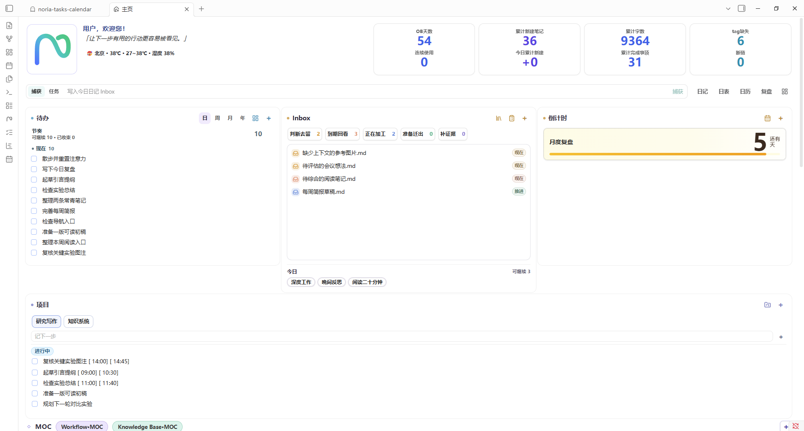
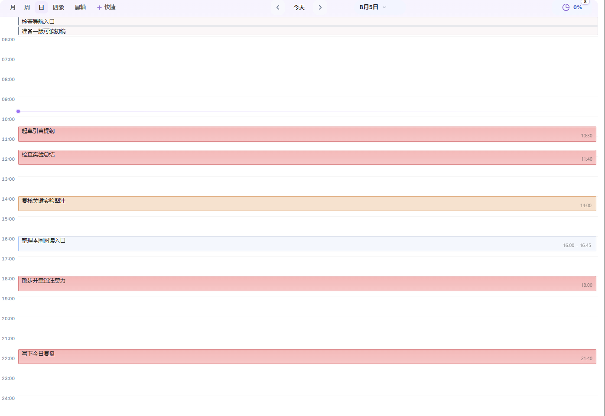
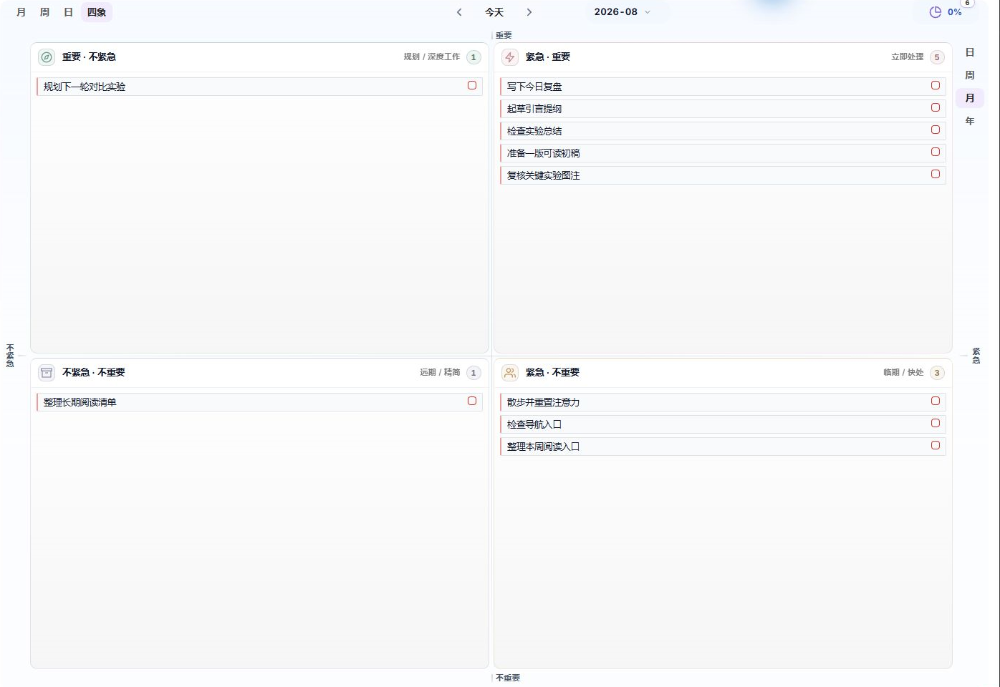
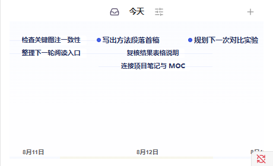
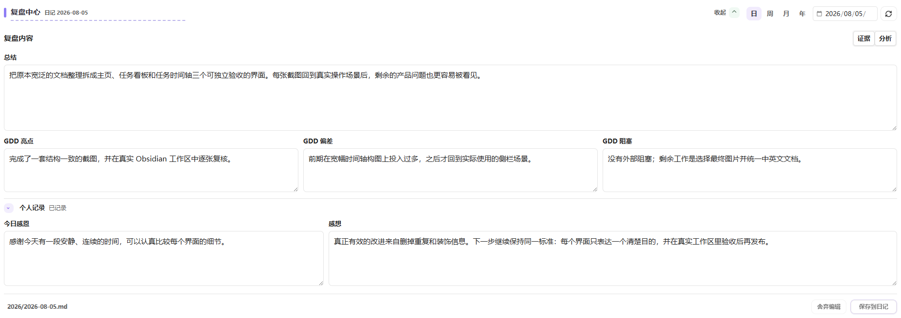

# Noria 用户手册

**语言**：[English](../USER-GUIDE.md) | 简体中文

Noria 把日常记录、知识积累、计划、执行与复盘连接到同一个 Obsidian 工作台中。它以普通 Markdown 为内容基础，通过可配置主页、任务看板、任务时间轴、日历、习惯、趋势统计与复盘中心，帮助你看清当前状态、专注下一步，并让长期积累持续服务于行动。

本手册从首次安装开始，依次介绍各模块、常用工作流、故障排查以及高级扩展。插件概览和版本信息见 [中文 README](../../README.zh-CN.md)。

## 1. 安装与初始化

### 1.1 安装要求

Noria 当前为桌面端插件，最低支持 Obsidian `1.5.0`。

通过社区插件市场安装时，搜索 **Noria** 并启用即可。手动安装时，只把 GitHub Release 中的三个文件放入：

```text
.obsidian/plugins/noria/
├── manifest.json
├── main.js
└── styles.css
```

Obsidian 在保存设置后会生成 `data.json`。不要把源码仓库中的 `src/`、`tests/`、`scripts/` 或 `node_modules/` 复制进用户插件目录。

插件界面跟随 Obsidian 语言；无法识别时回退英文。

### 1.2 选择工作区方式

首次打开“设置 → Noria → 总览”时，选择一种方式：

- **标准工作区**：适合新库、测试库，或希望把 Noria 内容集中在 `Noria/` 下的用户。
- **自定义路径**：适合已经有 Inbox、Projects、Diary、MOC 和模板结构的知识库。

IPARA 不是第三种 profile。已有 IPARA 知识库应选择“自定义路径”，再把 Noria 清单与工作流映射到 `02_Areas/Noria/`，把内容目录映射到现有根桶。

### 1.3 初始化流程

Noria 不会在启动时静默创建或移动文件。建议按以下顺序完成初始化：

1. 查看工作区预览和缺失项。
2. 检查 Inbox、Projects、Diary、模板和清单路径。
3. 确认计划创建的文件和父目录。
4. 点击初始化或修复。
5. 打开主页，检查示例项目、任务、习惯和倒计时。
6. 从示例任务跳转到 Markdown 来源，确认看板和时间轴读取的是同一条任务。

初始化只创建缺失内容，不覆盖已有文件。新用户可以保留少量示例任务熟悉流程，确认后再删除或替换。

### 1.4 初始化后的第一轮检查

- 主页可以打开，默认头像在未指定时使用 Noria 图标。
- 任务看板四个视图可以切换。
- 任务时间轴无需先打开任务看板即可加载。
- 日历创建的周期笔记进入正确路径。
- 习惯、倒计时、项目和 MOC 入口可打开来源文件。
- 复盘中心位于主页，日、周、月、年模式均可选择。
- 新安装时天气默认关闭；第一次显式初始化工作区后启用，后续修复会保留用户选择。需要时配置位置或 provider。

## 2. 主页

主页是 Noria 的中心工作台，不是固定的功能集合。它负责把当前状态、下一步、知识入口和阶段观察组织在一张可配置页面中。



### 2.1 首屏结构

默认首屏按以下顺序组织：

1. 身份、名言、天气和概览指标。
2. 捕捉、任务输入和“继续推进”。
3. 待办、Inbox 与倒计时三列工作卡。
4. 项目和 MOC 导引。
5. 趋势统计与复盘中心。

默认顺序只是起点。每个主要卡片都可以作为一级小组件独立调整。

### 2.2 捕捉与任务输入

主页顶部提供两种输入：

- **捕捉**：写入今日日记的 Inbox，适合想法、线索和临时记录。
- **任务**：写入今日日记任务区域，适合已经明确需要执行的事项。

输入、模式切换、提交动作和右侧导航保持在同一水平线上。捕捉后不要求立即分类。

### 2.3 待办

主页待办默认按节奏组织，强调当前可做的事情，而不是持续展示截止压力。

- 未完成任务使用更明确的字重。
- 已完成任务正常显示，不使用强烈删除式视觉。
- 建议优先处理的任务自然排在前面并使用轻量标记，不额外生成建议框。
- 点击任务直接打开来源；悬停显示日期、标签、项目和来源等详情。
- 日、周、月、年范围切换继续保留。

任务无法完成时可以在第二天继续，不需要把延期本身设计成惩罚。

### 2.4 Inbox

Inbox 卡片显示当前队列、工作流分组和少量可继续处理的条目。右上角保留切换视图、打开队列和新增入口，导引区不再重复放置第二套 Inbox 卡片。

卡片下方可以显示今日习惯的紧凑入口，但不重复完整习惯历史。

### 2.5 倒计时

倒计时放在首屏第三列。每条倒计时突出剩余天数和进度条，不重复显示可以从来源推导的日期。紧急程度使用克制的语义色，不使用边轨或大面积警告色。

### 2.6 项目与 MOC

- 项目卡片连接项目登记项、项目主笔记和当前未完成任务。
- MOC 卡片提供稳定知识入口；Markdown 是主入口，Canvas 是可选视觉视图。
- 主页只保留入口和当前动作，不复制完整项目或知识正文。

### 2.7 主页小组件

在主页编辑模式或“设置 → Noria → 主页”中，可以：

- 启用或隐藏组件；
- 拖动调整顺序；
- 调整宽度和布局跨度；
- 设置默认展开或收起；
- 添加 Markdown、操作、统计、Base、列表或可信自定义 view；
- 恢复被隐藏的内置组件。

同一行卡片会按网格行对齐高度。卡片悬浮设置控件位于边界附近，不应遮挡卡片自身按钮。

### 2.8 外部 Markdown 工作台

Markdown 小组件可以读取外部 Agent、RSS 流程或其他脚本生成的每日简报、当前建议、每周回顾和项目监控文件。Noria 负责展示、来源跳转和新鲜度提示，内容仍由对应外部流程生成。

## 3. 任务看板

任务看板把日记、项目和普通笔记中的 Markdown 任务组织成四种互补视图。任务始终保留在来源文件中。

### 3.1 月视图

用于观察月度任务分布、跨日任务、截止位置和一段时间内的工作密度。适合先看整体，再进入周或日视图安排时段。


### 3.2 周视图

用于安排一周内的任务和时间段。并列任务会根据列宽和高度自适应标题与时间信息，空间不足时优先保留任务辨识度。


### 3.3 日视图

用于安排当天的具体时间。无时段任务和全天事项保持在顶部，具体时间任务进入小时网格。



### 3.4 四象限

用于在任务较多时重新判断重要性和紧迫性。四个区域是同一任务池的不同组织方式，不会复制任务。



### 3.5 编辑任务

任务编辑器支持：

- 标题和标签；
- 优先级与状态；
- `start`、`scheduled`、`due`、`completion` 等日期；
- 开始和结束时间；
- 循环关系和前后依赖；
- 打开来源、保存和删除。

在任意 Markdown 笔记中，也可以把光标放在任务或普通文本行上，运行 **Noria: Edit or create task at cursor**。

### 3.6 创建周期笔记

点击没有对应笔记的日期时，默认直接按当前模板创建。需要确认时，可以在日历设置中开启创建确认。目标目录和模板来自当前路径配置。

## 4. 任务时间轴

任务时间轴是 Noria 自有的时间视图，用于观察任务在日期、时段和阶段中的关系；任务仍来自原始 Markdown，视图只负责组织、筛选和交互。



### 4.1 主编辑区与侧边栏

- 主编辑区适合较长时间范围、图层筛选和批量观察。
- 侧边栏适合常驻查看当前节奏，标题会根据可用纵向空间自适应排列。

时间轴在 Obsidian 恢复工作区后应直接加载，不应要求先打开任务看板。

### 4.2 导航与尺度

- 点击 **Today** 回到今天。
- 普通滚轮横向平移时间。
- 拖动空白时间带进行平移。
- `Ctrl/Cmd + 滚轮` 缩放。
- 点击或拖动底部概览带快速导航。

刻度会根据范围切换年、月、日、时和分，不重复显示同一日期。

### 4.3 任务视觉与写回

任务标题、定位点和区间条构成一个条目：

- 点任务只保留一个与标题对应的定位点；
- 区间任务的左右手柄只在悬停或编辑时出现；
- 未完成任务使用更明确的字重，完成任务正常显示；
- 空间足够时尽量显示完整标题，冲突时再截断；
- 点击标题打开 Markdown 来源；
- 拖动任务或区间边界会写回原任务行。

写回前会检查来源指纹；来源已经变化时拒绝覆盖。

### 4.4 图层与筛选

可以选择任务、标记、笔记、Git、Noria 和番茄钟等图层。番茄钟默认关闭。

筛选支持：

- 显示或隐藏完成任务；
- 文本查询；
- 仅显示指定标签；
- 排除指定标签；
- 标记模式。

筛选只改变观察方式，不修改任务。

### 4.5 命名视图

常用时间轴状态可以保存为自定义命名视图，内容包括：

```text
名称、时间中心、显示尺度、图层、完成态、查询、包含标签、排除标签、标记模式
```

视图状态变化后显示“已修改”，只有显式更新才覆盖已保存视图。

## 5. 日历

Noria 日历位于侧边栏，用于定位和创建日、周、月、季、年周期笔记。

### 5.1 主要操作

- 点击日期打开对应日记；
- 切换日、周、月、季、年入口；
- 快速回到今天；
- 在目标不存在时创建周期笔记；
- 使用配置的模板生成初始内容。

### 5.2 创建行为

默认点击缺失日期时直接创建。设置中可以改为创建前确认，也可以配置创建后是否自动打开。

### 5.3 日期来源

日历支持三种来源：

- **Noria**：使用“总览 → 路径”中的 Diary root 与模板。
- **Daily Notes**：读取 Obsidian Daily Notes 配置。
- **Custom**：单独指定目录、命名格式和模板。

界面只显示当前来源需要的字段，避免同时出现多套互相竞争的目录设置。

## 6. 习惯

习惯系统把“今天是否完成”和“长期是否形成”分开呈现。

### 6.1 今日习惯

主页 Inbox 卡片下方可以显示今日习惯入口。这里负责快速打卡，不重复历史图表。

### 6.2 习惯卡片

完整习惯卡片显示习惯名称、日期列和打卡状态。习惯名称复用 MOC 卡片的标题字号与字重，保持全插件文字层级一致。

支持：

- 勾选型习惯；
- 数值型习惯；
- 目标值和单位；
- 新增、编辑、暂停和标记已养成；
- 从 `#tl/sleep` 刷新睡眠习惯。

### 6.3 历史与热力图

完整习惯历史放在“趋势和统计”中。今日 chips 不在历史卡片重复显示。习惯历史、单习惯热力图和汇总热力图都作为可独立添加、隐藏、排序和调整尺寸的主页组件。

## 7. 趋势和统计

趋势和统计用于观察持续变化，不用于每天评价自己。

### 7.1 共享时间范围

所有统计卡片共享一套范围控制：

- 最近 30 天；
- 周；
- 月；
- 年；
- 自选范围。

### 7.2 笔记趋势

笔记趋势统计新建笔记数量和当前日记字数。字数表示当前文件内容，不等同于当天新增字数。

### 7.3 任务完成趋势

显示任务活动总量、完成量和完成率。没有完成日期的已完成任务保留在“无日期完成”中，不强行放入某一天。

### 7.4 习惯与工作量热力图

- 习惯热力图可以选择具体习惯或查看汇总。
- 工作量热力图把笔记、任务和字数等活动规范化为相对强度，不是精确工时。

### 7.5 笔记占比

笔记占比按知识库顶层目录统计，不按标签统计。它用于观察内容长期分布，而不是评价目录多少。

### 7.6 日态分布

日态卡片显示心情、天气、能量和专注等连续信号。心情、能量和专注可以编辑；天气为只读服务结果。卡片与同排统计卡等高，并在信息稀疏时保持克制。

## 8. 复盘中心

复盘中心位于主页，支持日、周、月、年四种周期。它以最终稿为中心，证据和外部分析按需展开。



### 8.1 基本流程

1. 选择周期和目标日期。
2. 直接在最终编辑器中开始书写。
3. 需要时展开证据和分析。
4. 准备本地 evidence，并将外部 Agent 提示词保存到 Noria 本地缓存。
5. 刷新并检查外部复盘笔记。
6. 只采纳有依据且有行动价值的内容。
7. 明确保存到日记或周期笔记。

### 8.2 日复盘

日复盘最终稿包含：

- 总结；
- GDD 亮点、偏差与阻塞；
- 今日感恩；
- 个人感想。

感恩和个人感想使用一致的编辑高度。个人记录不会由外部分析自动推断或覆盖。心情、天气、能量和专注属于独立日态数据。

### 8.3 周、月、年复盘

周期复盘使用一个完整 Markdown 最终编辑器。保存时写入对应周期笔记的复盘小节，而不是拆成多个重复表单。

### 8.4 Evidence 与外部 Agent

Noria 为外部 Agent 提供本地 evidence JSON 和提示词，不在插件内调用模型。`noria-review` 可以结合：

- Noria 当期 evidence；
- 目标日期的 Codex 对话；
- 候选项目对应的任务三件套；
- 可以验证的文件、测试和 Git 产物。

复盘按项目 owner 分组，只保留一条全局主线，不为每个项目机械生成下一步。

### 8.5 保存保护

- 未保存内容进入恢复草稿；
- 目标笔记在外部发生变化时阻止覆盖；
- 外部分析只作为可编辑草稿；
- 只有显式保存才写入 Markdown。

## 9. 设置

Noria 设置按七页组织。

### 9.1 总览

用于初始化和检查工作区：

- 标准工作区与自定义路径；
- 缺失文件和目录；
- 路径组；
- 模块开关；
- 查询范围与性能；
- 初始化、修复和打开入口。

### 9.2 主页

用于配置：

- 显示名称、称呼、头像和名言；
- 一级主页小组件；
- MOC 入口；
- Inbox 工作流；
- 复盘提示词；
- 天气。

主页只保留一个统一小组件管理器，不再同时显示旧首屏、工作台和趋势管理器。

### 9.3 任务

用于配置任务看板打开方式、扫描范围、包含与排除标签、状态策略和高级查询。

### 9.4 时间轴

用于配置打开位置、拖动步长、默认图层、完成态、尺度、命名视图和上下文刻度。

### 9.5 日历

用于选择 Noria、Daily Notes 或 Custom 日期来源，并设置创建确认、创建后打开、今日高亮和周期模板。

### 9.6 外观

用于调整界面密度、主题跟随、状态色、标签色和规划器细节。外观设置优先使用可见的语义选项，不要求普通用户编辑原始 token。

### 9.7 维护

用于：

- 检查 Noria 安装；
- 保存故障排查报告；
- 导出和导入设置备份；
- 查看 SecretStorage 状态；
- 管理可信自定义 JavaScript view；
- 展开开发者诊断。

## 10. Markdown、数据与外部工作流

### 10.1 数据边界

| 层级 | 内容 | 定位 |
| --- | --- | --- |
| 内容层 | 笔记、任务、项目、日记、习惯、倒计时 | 以 Markdown 或 Base 为准 |
| 配置层 | 路径、模块、主页布局、视图偏好 | 插件 `data.json` |
| 派生层 | 统计快照、复盘 evidence、恢复草稿 | 可重新生成的辅助数据 |
| 凭据层 | 天气服务密钥 | Obsidian SecretStorage |

Noria 不会把知识库转换成私有数据库。停用插件后，普通 Markdown 内容仍可阅读和编辑。

### 10.2 任务

Noria 识别标准 Markdown 任务：

```markdown
- [ ] 整理论文实验结果 [start:: 2026-08-04] [due:: 2026-08-07]
- [x] 完成初稿 [completion:: 2026-08-03]
```

任务可以包含 `start`、`scheduled`、`due`、`completion`、`created`、`cancelled` 和优先级等信息。看板、时间轴和日历编辑同一来源行。

### 10.3 时间轴事件

带 `#tl/` 标签和时间字段的任务可以进入时间轴。事件模板保存在 `Event library.md`：

```markdown
- [x] 深度工作 [default_tag:: #tl/focus] [default_start:: 09:00] [default_duration_min:: 90] #tl/template
```

### 10.4 习惯、项目与倒计时

- `Habits.md` 维护进行中、暂停和已养成习惯。
- `#habit` 任务默认不混入普通待办。
- `Projects.md` 使用分组和 wikilink 维护项目入口。
- `Countdowns.md` 使用 Markdown 表格保存重要日期。
- `Inbox workflow.md` 记录处置规则，`Inbox queue.base` 提供队列视图。

### 10.5 日记与复盘

日、周、月、年笔记仍是普通 Markdown。模板中的 Noria view block 负责动态视图，正文和个人记录仍由用户掌握。

### 10.6 外部内容进入主页

Markdown 简报来源使用：

```text
名称 | 路径 | 角色 | 新鲜度小时数
```

例如：

```text
每日简报 | Noria/Inbox/daily-brief.md | daily | 36
当前建议 | Noria/Inbox/current-suggestions.md | current | 72
```

可用角色包括 `daily`、`current`、`weekly`、`project` 和普通笔记。

### 10.7 外部 Agent 协作

1. 外部 Agent 读取指定 Markdown、复盘 evidence 或 Noria JSON 导出。
2. Agent 把简报、建议、项目监控或复盘结果写入约定文件。
3. Noria 展示这些内容并保留来源跳转。
4. 涉及日记和复盘正文时，由用户确认后写回。

### 10.8 安全边界

- 自定义 JavaScript view 默认关闭；
- 只运行显式信任的库内相对路径；
- 禁止协议地址、绝对路径和路径穿越；
- Noria 不静默移动笔记、重组目录或改写无关正文。

## 11. 常用工作流

Noria 不要求每天完整使用所有模块。

### 11.1 开始一天

1. 打开主页查看“继续推进”和当前项目。
2. 在待办卡片中选择当前节奏下适合处理的任务。
3. 查看今天的习惯和临近倒计时。
4. 需要安排具体时段时，再进入任务时间轴或日历。

### 11.2 随手捕捉

- 想法和线索使用“捕捉”写入今日日记 Inbox。
- 已经明确可执行的事项使用“任务”。

### 11.3 处理 Inbox

按以下顺序判断：

```text
delete → merge → split/refine → file/archive → defer
```

内容离开 Inbox 后，应清除临时 `inbox-*` 字段。

### 11.4 使用任务看板

- 月表看长期分布；
- 周表安排近期节奏；
- 日表处理当天时段；
- 四象限重新判断优先级。

### 11.5 使用任务时间轴

1. 用 Today、滚轮、空白拖动或底部概览带定位范围。
2. 选择图层、完成态和标签筛选。
3. 点击标题打开来源，悬停查看详情。
4. 必要时拖动任务或区间边界调整时间。
5. 把常用中心、尺度、图层和筛选保存为命名视图。

### 11.6 推进项目与知识积累

从主页项目卡片进入项目主笔记，在项目中维护任务和阶段输出，再把可长期复用的结论连接到对应 MOC。

### 11.7 使用习惯和趋势

主页只处理今日打卡；完整习惯历史和热力图放在趋势区。趋势更适合周复盘和月复盘，不用于每天评价自己。

### 11.8 接收外部简报

外部流程生成 Markdown，主页显示摘要和来源。阅读后再决定是否转为任务、项目材料或长期笔记。

### 11.9 完成日复盘

直接书写最终稿；需要时准备 evidence 并使用外部 Agent；只采纳有证据的内容，最后明确保存到日记。

### 11.10 周期复盘与调整

查看任务、项目、习惯、日态和趋势证据，区分已完成、仍有价值、需要调整和应当停止的事项，只保留少量下一阶段重点。

### 11.11 最小使用方式

```text
主页捕捉 → 选择下一项任务 → 完成后更新 Markdown → 必要时复盘
```

## 12. FAQ 与故障排查

### 12.1 统一排查顺序

1. **入口**：模块是否启用，打开的是否为预期视图。
2. **来源**：Markdown 是否存在、已保存且格式正确。
3. **范围**：路径、扫描范围、日期和标签筛选是否包含目标内容。
4. **刷新**：先使用界面刷新或重试，再重新打开视图。
5. **诊断**：到“维护”运行安装检查并保存报告。

不要一开始就删除 `data.json`、重建全部文件或重装插件。

### 12.2 视图打开后空白

检查插件和模块是否启用、路径是否缺失、视图是否仍在延迟加载，再使用“重试”或重新打开。任务时间轴若每次重启都必须先打开任务看板，属于启动恢复故障。

### 12.3 任务没有显示

检查标准任务语法、来源保存状态、扫描范围、包含与排除标签、日期范围，以及当前视图是否隐藏完成、取消、无日期或习惯任务。

### 12.4 看板、时间轴和日历不一致

先比较日期范围、完成态、标签筛选和无日期任务策略。三者使用同一任务事实，但展示目标不同，不能只比较条目数量。

### 12.5 时间轴加载慢或不能操作

确认不是诊断空壳，缩小任务扫描范围，减少无关图层，并检查来源冲突。持续空白、滚轮无响应或只能通过重新执行命令恢复时，应作为故障报告。

### 12.6 文件创建到了错误目录

检查“总览 → 路径”中的 Diary、Inbox、Projects、模板和清单路径。“替换全部路径”会切换整套引用，使用前先查看预览。

### 12.7 主页小组件没有内容

检查组件是否启用、来源路径是否存在、文件是否为空、简报是否过期，以及组件是否被隐藏。Markdown 过期时不应继续伪装成当前信息。

### 12.8 统计结果与预期不同

检查共享时间范围、任务完成日期、笔记扫描范围、日记命名、习惯来源和文件保存状态。数据不完整不等于零。

### 12.9 复盘无法保存或没有更新

检查目标周期笔记和路径。外部 Agent 更新后点击刷新；出现来源冲突时先比较目标笔记，不要强制覆盖。

### 12.10 天气没有显示

新安装默认关闭天气。启用后选择位置或城市，按 provider 需要配置 SecretStorage 凭据，再手动刷新验证。

### 12.11 外部简报没有显示

检查目标 `.md` 是否生成、来源路径和角色是否正确、修改时间是否超过新鲜度，以及正文是否为空。

### 12.12 恢复设置

优先使用设置备份、补齐缺失路径、恢复单个模块默认值或重新生成缺失文件。只有明确需要清空全部设置时才删除 `data.json`。

### 12.13 报告问题

提供 Noria、Obsidian 和操作系统版本、模块、最短复现步骤、截图、维护报告和相关控制台错误。不要提交 API 密钥、完整私人日记或无关知识库内容。

## 附录 A：路径与数据存储

### A.1 标准工作区

| 用途 | 默认路径 |
| --- | --- |
| 时间轴设置 | `Noria/Timeline settings.md` |
| 事件模板库 | `Noria/Event library.md` |
| 倒计时 | `Noria/Countdowns.md` |
| 习惯清单 | `Noria/Habits.md` |
| 项目清单 | `Noria/Projects.md` |
| Inbox 工作流 | `Noria/Inbox workflow.md` |
| Inbox 队列 | `Noria/Inbox queue.base` |
| Inbox 内容 | `Noria/Inbox/` |
| 项目目录 | `Noria/Projects/` |
| 日记目录 | `Noria/Diary/` |
| 日、周、月、年模板 | `Noria/Templates/` |
| 头像与名言 | `Noria/avatar.svg`、`Noria/Quotes.md` |

标准初始化还可以创建 `Noria/Workflow·MOC.md` 和 `Noria/Knowledge Base·MOC.md`。当前版本不需要 `Noria/Home.md`，主页是插件视图。

### A.2 推荐的 IPARA 自定义映射

| 用途 | 推荐路径 |
| --- | --- |
| Noria 清单与工作流 | `02_Areas/Noria/` |
| Noria 模板 | `02_Areas/Noria/Templates/` |
| Inbox 内容 | `00_Inbox/` |
| 项目内容 | `01_Projects/` |
| 日记与周期笔记 | `06_Diary/` |
| MOC 入口 | `05_MOC/` |
| 头像与名言 | `02_Areas/Noria/` |

修改配置不会自动移动原文件。初始化只创建缺失内容。

### A.3 插件配置与缓存

```text
.obsidian/plugins/noria/data.json
.obsidian/plugins/noria/cache/stats/snapshots/
.obsidian/plugins/noria/cache/stats/tasks/
.obsidian/plugins/noria/cache/stats/review/
.obsidian/plugins/noria/cache/review/recovery-drafts.json
```

Markdown、Base、Canvas、模板和复盘笔记需要长期保留。统计缓存和 evidence 可以重新生成；清理缓存前先确认没有未保存的复盘恢复草稿。

### A.4 复盘路径

复盘最终稿跟随 Diary root：

```text
06_Diary/2026/2026-08-04-review.md
06_Diary/2026/2026-W32-review.md
06_Diary/2026/2026-08-review.md
06_Diary/2026/2026-review-month.md
06_Diary/2026/2026-review-week.md
```

标准工作区使用相同命名规则，只把根目录换成 `Noria/Diary/`。

### A.5 迁移与备份

迁移时优先保留用户内容、Noria 清单与模板、复盘笔记和设置导出。通常不需要迁移统计缓存；天气等 SecretStorage 凭据需要在新设备重新配置。

## 附录 B：高级与开发参考

### B.1 扩展边界

Noria 提供三类扩展方式：

1. Markdown 文件契约；
2. 版本化 JSON 导出；
3. 可信自定义 JavaScript view。

内部 DOM、CSS 类名、缓存实现、刷新 hook 和源码模块路径不属于稳定公共接口。

### B.2 自定义 JavaScript view

自定义 view 默认关闭。启用后，库内 JavaScript 会获得 Obsidian、Noria、`window` 和 `document` 的访问能力；它不是安全沙箱。

```js
const bridge = input.noriaBridge;
const result = await bridge.data.getSnapshot({
  preset: "home",
  range: { mode: "last30" }
});

const el = document.createElement("pre");
el.textContent = JSON.stringify(result.range, null, 2);
input.mount.appendChild(el);
```

只运行自己编写或已经审查的代码，并优先使用注入的 `input.noriaBridge`。

### B.3 公共 Data API

```js
bridge.data.resolveRange(request)
bridge.data.getSnapshot(request)
bridge.data.getTasks(request)
bridge.data.getTimelineAnnotations(request)
bridge.data.getTimelineTraces(request)
bridge.data.getPeriods(request)
bridge.data.getReviewEvidence(request)
bridge.data.export(request)
```

`data.invalidate()` 是内部刷新 hook，不作为公共接口承诺。

### B.4 范围与 preset

范围支持 `last30`、`week`、`month`、`year`、`custom` 和 `homeCurrent`。内置 preset 包括 `home`、`board`、`timeline`、`periodic`、`review` 和 `exportAll`。

### B.5 Snapshot

```json
{
  "meta": { "schemaVersion": 1, "request": {}, "resolvedRequest": {}, "policy": {} },
  "range": {},
  "granularity": "day",
  "domains": {},
  "views": {},
  "warnings": [],
  "sourceCompleteness": {}
}
```

调用方必须检查 `schemaVersion`、`warnings` 和 `sourceCompleteness`。

### B.6 任务事实与写回

任务身份由以下信息共同确定：

```text
sourcePath + line/blockId + fingerprint
```

写回必须定位原 Markdown、检查来源指纹、只修改目标任务行，并在来源变化时拒绝覆盖。渲染器本身不直接改写知识库。

### B.7 JSON 导出

```json
{
  "exportKind": "noria.snapshot",
  "exportVersion": 1,
  "exportedAt": "",
  "noriaVersion": "0.4.2",
  "payload": {}
}
```

支持 `noria.snapshot`、`noria.tasks` 和 `noria.reviewEvidence`。外部工具应根据 `exportKind` 和 `exportVersion` 解析。

### B.8 兼容性

扩展应检查 `bridgeVersion` 和数据 `schemaVersion`，对可选字段进行特性检测，不依赖内部属性顺序，不直接修改 `data.json`，也不读取或输出 SecretStorage 凭据。

### B.9 源码验证

```bash
npm ci
npm run build
npm test
npm run release:check
```

公开安装包只包含 `manifest.json`、`main.js` 和 `styles.css`。
